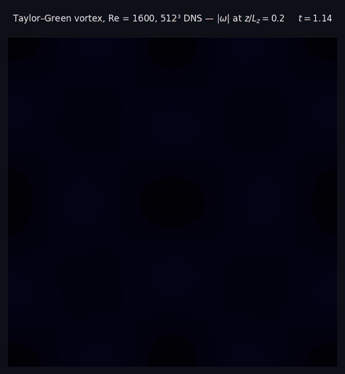
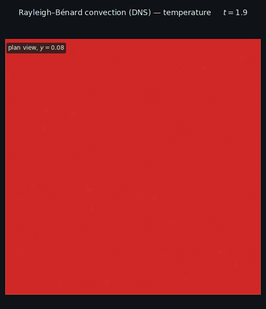
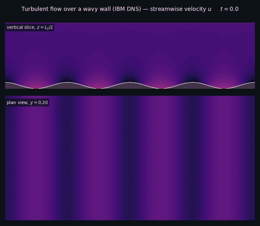
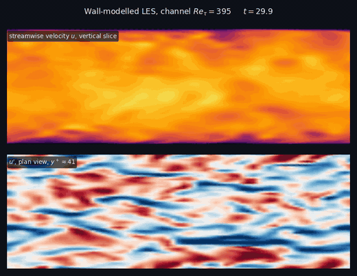

# dopamine-fdm

A finite-difference Navier–Stokes solver for turbulent channel and open-channel flows, with immersed-boundary (IBM) rough walls, wall models, SGS modelling, an exact Reynolds-stress budget module, and a UAV actuator-disk rotor model. MPI-parallel (2decomp&fft pencils), with an optional single- or multi-GPU OpenACC build.

|  |  |
|:--:|:--:|
| <br>**Taylor–Green vortex**, Re = 1600, 512³ DNS — vorticity magnitude | <br>**Rayleigh–Bénard convection** — temperature |
| <br>**Turbulent flow over a wavy wall** (ghost-cell IBM DNS) — streamwise velocity | <br>**Wall-modelled LES**, channel Re<sub>τ</sub> = 395 — streamwise velocity and near-wall streaks |

## Highlights

- Fractional-step projection on a staggered MAC grid, RK3 time stepping, spectral pressure solver
- Periodic, wall (DNS no-slip or EQWM) and inflow/outflow boundaries; stretched wall-normal (and spanwise) grids
- Ghost-cell IBM from precomputed signed-distance fields; flat-wall and IBM equilibrium wall models
- Vreman SGS model, Boussinesq temperature, suspended-sediment transport, synthetic-eddy inflow
- Reynolds-stress budget statistics, line/slice probes, UAV actuator disk

## Quick start

```bash
sudo apt install gfortran libopenmpi-dev libfftw3-dev liblapack-dev libblas-dev cmake git
cmake -S . -B build -DCMAKE_BUILD_TYPE=Release && cmake --build build -j$(nproc)
mkdir -p fields restart stats
mpirun -np 4 ./build/dopamine        # reads ./input_parameters
```

## Documentation

| | |
|---|---|
| [Installation & Running](docs/Installation.md) | dependencies, CPU/GPU builds, output layout |
| [Input Parameters](docs/Input-Parameters.md) | every namelist variable |
| [Numerics](docs/Numerics.md) | governing equations and discretisation |
| [Examples](docs/Examples.md) | bundled example cases |
| [Tools](docs/Tools.md) | GenSDF and post-processing scripts |
| [Showcase Animations](docs/Animations.md) | how the animations above are made |
| [Code Structure](docs/Code-Structure.md) | repository layout |
| [References](docs/References.md) | methods implemented |

## License

This program is free software: you can redistribute it and/or modify it under the terms of the GNU Affero General Public License as published by the Free Software Foundation, either version 3 of the License, or (at your option) any later version.

See [LICENSE](LICENSE) for the full text.

## Acknowledgments

The original form of the channel flow solver was shared by Adrian Lozano-Duran during my PhD and I am grateful for his generous help and support with the code. A large portion of this code was written while listening to some wonderful music — thanks to [Myrath](https://www.myrath.com/), [Bloodywood](https://www.bloodywood.net/), [Leprous](https://leprous.net/), [Peekay](https://www.peekay.live/), [Ihsahn](https://ihsahn.com/), and [Gojira](https://gojira-music.com/) for the wonderful company during long debugging sessions.

## Citing this solver

If you use `dopamine-fdm` in your research, please consider citing the following publications.

1. Lozano-Durán, A., & Bae, H. J. (2019). Characteristic scales of Townsend's wall-attached eddies. *Journal of Fluid Mechanics*, 868, 698–725. doi:[10.1017/jfm.2019.209](https://doi.org/10.1017/jfm.2019.209) — *original DNS solver*
2. Patil, A., & Fringer, O. (2022). Drag enhancement by the addition of weak waves to a wave-current boundary layer over bumpy walls. *Journal of Fluid Mechanics*, 947, A3. doi:[10.1017/jfm.2022.628](https://doi.org/10.1017/jfm.2022.628) — *IBM + DNS*
3. Patil, A., & García-Sánchez, C. (2025). Should we care about the spatial heterogeneity in coral reefs under unidirectional turbulent flows? arXiv:[2506.03021](https://arxiv.org/abs/2506.03021) [physics.flu-dyn] — *improved IBM*
4. Patil, A., Paranjothi, U. C. K., & García-Sánchez, C. (2025). GenSDF: An MPI-Fortran based signed-distance-field generator for computational fluid dynamics applications. *SoftwareX*, 30, 102117. — *GenSDF*

<details>
<summary>BibTeX</summary>

```bibtex
@article{lozanoduran2019characteristic,
  title={Characteristic scales of {T}ownsend's wall-attached eddies},
  author={Lozano-Dur{\'a}n, Adri{\'a}n and Bae, Hyunji Jane},
  journal={Journal of Fluid Mechanics},
  volume={868},
  pages={698--725},
  year={2019},
  publisher={Cambridge University Press},
  doi={10.1017/jfm.2019.209}
}

@article{patil2022drag,
  title={Drag enhancement by the addition of weak waves to a wave-current boundary layer over bumpy walls},
  author={Patil, Akshay and Fringer, Oliver},
  journal={Journal of Fluid Mechanics},
  volume={947},
  pages={A3},
  year={2022},
  publisher={Cambridge University Press},
  doi={10.1017/jfm.2022.628}
}

@misc{patil2025carespatialheterogeneitycoral,
  title={Should we care about the spatial heterogeneity in coral reefs under unidirectional turbulent flows?},
  author={Patil, Akshay and Garc{\'i}a-S{\'a}nchez, Clara},
  year={2025},
  eprint={2506.03021},
  archivePrefix={arXiv},
  primaryClass={physics.flu-dyn},
  url={https://arxiv.org/abs/2506.03021}
}

@article{patil2025gensdf,
  title={{GenSDF}: An {MPI-Fortran} based signed-distance-field generator for computational fluid dynamics applications},
  author={Patil, Akshay and Paranjothi, Uma Chandrika Karrothu and Garc{\'i}a-S{\'a}nchez, Clara},
  journal={SoftwareX},
  volume={30},
  pages={102117},
  year={2025},
  publisher={Elsevier}
}
```

</details>
