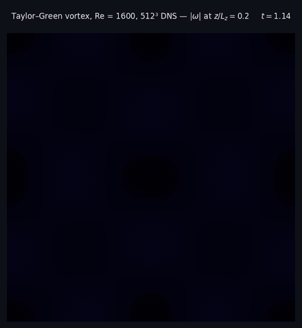
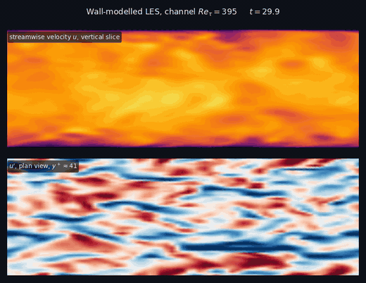
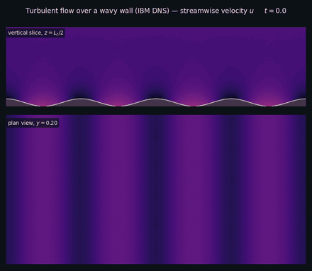
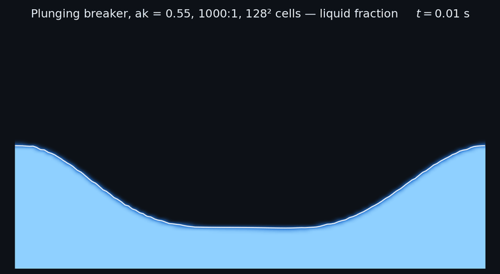

# dopamine-fdm

A parallel finite-difference solver for the 3-D incompressible Navier–Stokes equations, aimed at turbulent channel and open-channel flows: rough-wall immersed boundaries, wall models, LES, an exact Reynolds-stress budget, a UAV actuator-disk rotor and an optional two-fluid (air–water, 1000:1) VOF solver. MPI-parallel, with an optional single- or multi-GPU build.

| | |
|:--:|:--:|
| <br>**Taylor–Green vortex**, Re = 1600, 512³ DNS | <br>**Wall-modelled LES**, channel Re<sub>τ</sub> = 395 |
| <br>**Flow over a wavy wall** (ghost-cell IBM DNS) | <br>**Plunging breaking wave** (PLIC-VOF, 1000:1) |

## Where to start

| I want to… | Go to |
|---|---|
| build and run the solver | [Installation](Installation.md) |
| set up a case | [Input Parameters](Input-Parameters.md) and the [bundled Examples](Examples.md) |
| understand the equations and discretisation | [Numerics](Numerics.md) |
| simulate waves or an air–water interface | [Two-Phase VOF](Two-Phase-VOF.md) |
| make a mesh or signed-distance field, or post-process | [Tools](Tools.md) |
| modify the code or run the consistency checks | [Development](Development.md) |
| see which published methods are implemented | [References](References.md) |

## At a glance

- **Numerics**: staggered MAC grid, second-order central differences, low-storage RK3, fractional-step projection with a spectral pressure solver (FFTW3 + [2decomp&fft](https://github.com/2decomp-fft/2decomp-fft) transposes), stretched wall-normal and spanwise grids.
- **Boundaries**: periodic, no-slip or free-slip walls, 4-wall ducts, inflow/outflow with constant, synthetic-eddy (ESEM) or recycled-precursor inflow.
- **Walls and turbulence**: DNS, Vreman LES, flat-wall and IBM equilibrium wall models (smooth and rough), ghost-cell or staircase IBM from signed-distance fields.
- **Physics modules**: Boussinesq temperature, suspended sediment, Lagrangian particles, rotation, oscillatory forcing, UAV actuator disk.
- **Two-phase flow**: PLIC-VOF, consistent momentum transport (WENO5-Z), surface tension, wave-flume inlet and relaxation zones; off by default and then a strict no-op.
- **Diagnostics**: full Pope §7.4 Reynolds-stress budget, line/slice probes, per-stage profiler.
- **Parallel**: results are independent of rank count and layout and agree between CPU and GPU builds.

## Quick start

```bash
sudo apt install gfortran libopenmpi-dev libfftw3-dev liblapack-dev libblas-dev cmake git
cmake -S . -B build -DCMAKE_BUILD_TYPE=Release && cmake --build build -j$(nproc)
mkdir -p fields restart stats
mpirun -np 4 ./build/dopamine        # reads ./input_parameters
```

Details, GPU builds and the regression suite: [Installation](Installation.md).

## Source, license, citation

Source and issues: [github.com/AkshayPatil1994/dopamine-fdm](https://github.com/AkshayPatil1994/dopamine-fdm). Licensed under AGPL-3.0-or-later. Citation information and BibTeX are in the [README](https://github.com/AkshayPatil1994/dopamine-fdm#citing-this-solver).

> **Note on LLM-assisted code review:** this repository has undergone an LLM-assisted code cleanup and bug-fixing pass, including performance-related changes and code optimisations, as recorded transparently in the Git commit history.
