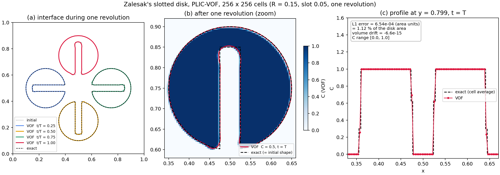
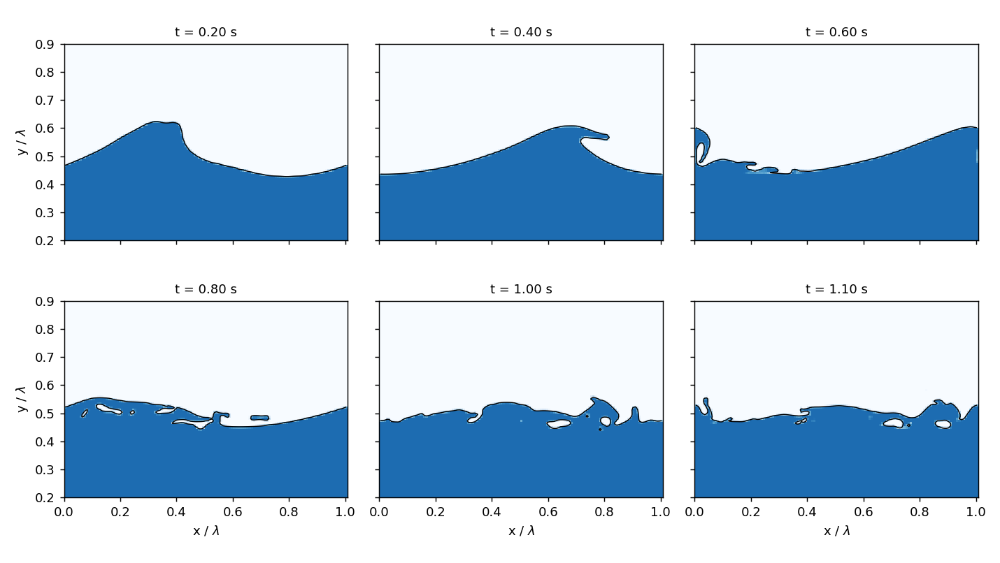

# Two-Phase VOF Solver

[← Home](Home.md)

A sharp-interface two-fluid (air–water) solver on the staggered grid of the single-phase code: the liquid fraction `C` is advected
with a geometric PLIC volume-of-fluid method, the momentum is transported with the same mass fluxes that advance the density, and
the variable-density pressure equation is solved by preconditioned CG whose preconditioner is the existing FFT Poisson solver.
Nothing is clipped, damped or capped: `C` stays in [0,1] and the liquid volume is conserved to round-off by construction.

The solver is selected by `vof_active = 1`, `vof_flow = 1` in [`&VOF`](Input-Parameters.md#vof). With
`vof_active = 0` (the default) none of it runs: the output is bit-for-bit that of the single-phase solver and the run time is
unchanged (checked on the regression suite against the commit the branch started from).

Contents: [1 Method](#1-method) · [2 Running](#2-running-and-output) · [3 Validation](#3-validation) ·
[4 Limits and known issues](#4-limits-and-known-issues) · [5 References](#5-references)

## 1. Method

The solver integrates the incompressible two-fluid equations in conservative one-fluid form (same index notation as the
[governing equations](Numerics.md#1-governing-equations) of the single-phase solver):

$$\frac{\partial \rho}{\partial t} + \frac{\partial (\rho u_j)}{\partial x_j} = 0,\qquad
\frac{\partial (\rho u_i)}{\partial t} + \frac{\partial (\rho u_i u_j)}{\partial x_j} = -\frac{\partial p}{\partial x_i} + \rho g_i + \frac{\partial}{\partial x_j}\left[(\mu+\mu_t)\left(\frac{\partial u_i}{\partial x_j} + \frac{\partial u_j}{\partial x_i}\right)\right] + \sigma\kappa\frac{\partial C}{\partial x_i},\qquad \frac{\partial u_i}{\partial x_i}=0,$$

$$\frac{\partial C}{\partial t} + \frac{\partial (C u_j)}{\partial x_j} = 0,\qquad \rho = \rho_g + (\rho_l-\rho_g)\,C,\qquad \mu = \mu_g + (\mu_l-\mu_g)\,C,$$

with $C$ the liquid volume fraction, $g_i$ gravity, $\sigma$ the surface tension and $\kappa$ the interface curvature.

### 1.1 Interface transport

`C` is advanced by direction-split sweeps (Weymouth & Yue 2010) with exact geometric face fluxes of liquid volume from the PLIC
planes of the donor cells (Youngs normals, `vof_normal_scheme = 1`, or centred-column height functions, `= 2`). The compression term
$\tilde C\,\partial u_j/\partial x_j$ makes every sweep conservative for a not-yet-divergence-free split velocity, so `C` remains in [0,1] without clipping.
The sweep order alternates every step. The advection half-step is sub-cycled with a frozen, divergence-free transporting velocity
(`vof_freeze_ut = 1`) until the sub-step Courant number is below `vof_co_sub` (0.12; 0.03 above density ratio 2000).

### 1.2 Consistent mass–momentum transport

The momentum $\rho u_i$ on each staggered control volume (CV) is advanced inside every sweep with the **same** mass flux that advanced the
density: the flux of $\rho u_i$ through a CV face is (CV-face mass flux) × (one face value of `u_i`). The mass flux of a CV is the mean of
the two cell fluxes it spans, plus the `ρ̃ · (volume-flux divergence)` correction of the split scheme. This is the construction of
Rudman (1998), Vaudor et al. (2017) and Pal, Fuster & Zaleski (2021); it avoids the spurious momentum production that occurs when
the density is advected by the interface method and the momentum by an independent scheme at 1000:1.

* **Face value** (`vof_mom_scheme`): WENO5-Z (default) from six-point stencils of the transported velocity `u = q/ρ`, blended
  to first-order upwind by a smooth step in the *refill Courant number* `ξ = |ṁ| |1/ρ₁ − 1/ρ₂| / V` between `vof_mom_cm0` and
  `vof_mom_cm1`. `ξ` is zero wherever the density is uniform (the kernel is then the plain fifth-order scheme) and active only in
  CVs whose mass turns over within a sweep, where a high-order weight could become negative.
* **Pseudo-time SSP-RK3** (`vof_rk_mom = 1`): inside a sweep the geometric fluxes are fixed and the CV density changes linearly from
  the old to the new value, so the momentum ODE `dq/dθ = tendency(q/ρ(θ))` is integrated with three kernel evaluations
  (θ = 0, 1, ½) instead of many sub-sweeps. It is stable for a full-step Courant number up to ≈0.3 at 1000:1. Above density
  ratio 2000 a stage would remove more than half of a CV's mass, so the solver switches to forward Euler with sub-steps
  (`vof_co_sub = 0.03`) automatically.

### 1.3 Pressure, gravity and density

* The staggered face density is the **geometric** one: the liquid fraction of each half cell is taken from the cell's PLIC plane
  (`vof_geo_density = 1`). Pressure gradient and gravity use this density, so a flat interface at any sub-cell position is
  hydrostatically exact. Transport uses the arithmetic mean of the two cell densities.
* $\dfrac{\partial}{\partial x_i}\!\left(\dfrac{1}{\rho}\dfrac{\partial p}{\partial x_i}\right) = \dfrac{1}{\Delta t}\dfrac{\partial u^*_i}{\partial x_i}$ is solved by PCG, preconditioned with the constant-coefficient fast Poisson solver of the single-phase
  code, to a relative residual `vof_pcg_tol = 0.2` (at most `vof_pcg_iters = 30`; a tighter tolerance gives the same physics,
  `vof_pcg_tol = 0.3, 0.1, 0.01` agree to three digits at 40 / 65 / 93 iterations per step for a 1000:1 standing wave).
  After each advection half-step the transporting velocity is projected with `vof_adv_iters` iterations.
* The same pressure machinery serves the Laplace/capillary problems of §1.5.

### 1.4 Viscous and SGS terms

`μ = μ_g + (μ_l − μ_g) C` at cells; edge viscosities use the **weighted harmonic mean** of the four cells around a shear edge
(layers in series carry a continuous shear stress). The arithmetic mean makes the explicit viscous stress next to a gas face stable
only for `ν_eff = μ_l / (2ρ_g)` — it diverges at density ratio ≥ 1e5. An SGS model (`sgs_model`) acts on the mixture, with
`ν_t` weighted by the local density.

**Wall model (`flat_wall_model_flag = 1` smooth, `2` rough with `z0_ylo`/`z0_yhi`).** At a no-slip y wall the log-law (Reichardt, or rough `z0`) wall stress `ρ u_τ²`, directed along the
tangential velocity of the first interior row, replaces the molecular stress at the wall edge of `viscous_accel` (`set_wall_stress`);
`ρ` is the face density and `u_τ` is solved with the viscosity of the phase at the wall. The single-phase Robin slip length is not used:
its floor at zero leaves it a plain no-slip condition on a grid whose first cell is at `y⁺ ≳ 10`, and without the floor the ghost
value is many times the interior one and corrupts the SGS gradient. The log law holds in one fluid only, so a column keeps no-slip
where the interface lies within the first two rows or one cell sideways (the `C` gate is 0.05 / 0.95). There is no contact-line
model. Free-slip walls take no stress. The stress is independent of the density ratio, and a uniform stream over a modelled bed
decays as the log law predicts (`vof_wm_stream`).

**IBM wall model (`ibm_wall_model_flag = 1`).** On every staircase face next to a fluid face (closed face = either neighbouring cell has `φ < 0`, the
mask of the pressure solve) the log-law stress `ρ u_τ²` along the tangential velocity of that fluid face replaces the viscous flux through
the edge in `viscous_accel` (`src/ibm_stress.f90`, `ibm_stress_update`). `u_τ` uses the distance from the face centre to the closed face
(half a cell), the viscosity of the phase (the same 0.05 / 0.95 single-fluid gate over the cell and its 26 neighbours; a gated face keeps
its stencil flux), and the per-object roughness `ibm_z0` when set. The ghost-point velocity mirror is not used. Validation: a uniform
stream over a flat plate decays as the integrated log law, independent of the density ratio (`vof_ibm_wm_plate`).

### 1.5 Surface tension

`vof_sigma > 0` adds the balanced-force term $\sigma\kappa\,(\partial C/\partial x_i)/\rho_f$ on the faces with the curvature from **height functions** (9-cell
columns in a 3×3 stencil, `vof_curv.f90`; cells whose columns do not end in a full and an empty cell take the mean of their
neighbours' valid curvatures, else zero, and are counted in column 30 of `vof_diag.dat`). The explicit time-step limit `Δt < √((ρ_l + ρ_g) h³ / (4π σ))` is folded into the acceleration CFL.
The same acceleration CFL carries the gravity-wave limit of the shortest resolvable wave (`k = π/h`, `ω² = g k + σ k³/(ρ_l + ρ_g)`,
`Δt < (π/2)/ω`; it reduces to the capillary limit for `g = 0`): without it the step grows with the small velocities of a nearly still
free surface and the explicit interface coupling goes unstable (seen at `vof_sigma = 0`, `Δt ≈ 0.1 s` at `h = 6 mm`).
`vof_sigma = 0` skips the curvature evaluation entirely.

### 1.6 Immersed boundaries

The ghost-cell IBM (`ibm_input_mode = 1`) is re-applied after every velocity update (force stage, both projections, start of the
step). For the interface and the pressure the body is a **staircase**: a face is closed if either cell it joins has a negative
signed distance (the faces the IBM zeroes or overwrites), a cell is a solid cell if all its faces are closed.

* the pressure operator, the pressure gradient and the divergence skip closed faces (Neumann condition at the body; the ghost-face
  velocities of the IBM are not touched by the projection);
* the **transporting velocity** is projected with a tight PCG on the same masked operator (the fast solver cannot honour the
  mask), so no liquid or momentum crosses the body and the liquid volume of the fluid region is conserved to round-off;
* the liquid fraction of the solid cells is a zero-gradient continuation (mean of the active 26 neighbours), so the reconstruction,
  the face densities and the curvature next to the body see a wall-like state; the transport never changes it. There is **no
  contact-angle model**;
* the hydrostatic row-mean reference density and all global diagnostics (`vof_diag.dat` volume, interface cells, pressure jump,
  shape error) exclude solid cells.

The masked system converges more slowly than the free one (the preconditioner is the unmasked fast solver): expect a factor
of 2-5 more PCG iterations, and use `vof_div_tol` rather than a tight relative tolerance. The staircase is first order in the
geometry for the transport and pressure; the velocity condition at the body keeps its second-order IBM treatment.

**Loads.** With `nsampling > 0` the two-fluid step writes `ibm_forces.csv` like the single-fluid solver: pressure (total pressure =
dynamic part + the still-water hydrostatic reference, so a submerged body feels buoyancy) and viscous traction (mixture viscosity
plus the SGS part) summed over the faces between fluid-type (signed distance >= 0) and solid-type cells, pressure linearly
extrapolated to the face. The load faces are the faces closed in the solver. The pressure level of a periodic box is arbitrary (closed bodies are unaffected). The IBM-impulse columns
(`Fx_ibm, ...`) are NaN: the pressure acts through the closed faces. Validation: a submerged sphere in still water
(`vof_ibm_buoy`) gives the buoyancy within 3 %, identical on 1 and 4 ranks. `ibm_surface_nsampling` is not available.

### 1.7 Waves, inlet and relaxation zones

For a numerical wave flume use `x_bc_type = 1` (inlet at x = 0, convective outlet), `inflow_type = 3` and the [`&WAVES`](Input-Parameters.md#waves)
namelist. `waves.f90` provides the target elevation and velocity of a long-crested wave travelling in +x over the still-water depth
`vof_level`: `wave_type = 1` linear (Airy), `2` Rienecker–Fenton stream function (`wave_sf_n` Fourier terms), `3` JONSWAP sum of
`wave_nfreq` linear components with seeded random phases, finite-depth dispersion and Wheeler stretching. The inlet is a Dirichlet
condition for `C` and the velocity; above the surface the air carries the uniform return flow `−Q/(L_y − d − η)` that makes the
volume flux through the inlet zero (closed flume, `wave_current_mode = 1`).

Relaxation zones (waves2Foam style) of length `wave_gen_len` at the inlet and `wave_abs_len` at the outlet blend `C`, `U` and `V`
toward the target wave (generation) or still water (absorption) with weight `1 − exp(−wave_relax_rate · s · Δt)`,
`s = (exp(r^3.5) − 1)/(e − 1)`, `r` the normalised position in the zone. The liquid volume added by the zones and through the
boundaries is tallied separately (columns 22 and 23 of `vof_diag.dat`) so that the ledger
`V − V₀ = bnd + relax` closes to round-off-plus-solver error. Surface-elevation gauges (`wave_gauge_x`) are written to `vof_gauges.dat`.

## 2. Running and output

Use `vof_flow = 1` with `cfl_adaptive = 1` for flows; the step is limited by the convective, viscous, acceleration (gravity and
capillary) and advection Courant numbers. Example input files: `tests/regression/vof_*_small/input_parameters` (see
[Examples](Examples.md#two-phase-vof-cases)).

`vof_diag.dat` (named header, written every `nmonitor` steps):

| Column | Quantity | Column | Quantity |
|--------|----------|--------|----------|
| 1, 2, 3 | step, `t`, `dt` | 16–18 | `max |U|`, `max |V|`, `max |W|` (true absolute maxima) |
| 4, 5 | liquid volume, relative drift | 19, 20 | PCG iterations in the step, last relative residual |
| 6, 7 | `C_min`, `C_max` | 21 | advection sub-steps per half-step |
| 8 | interface cells | 22, 23 | liquid volume through the boundaries / added by the relaxation zones (cumulative) |
| 9 | liquid volume removed by clamping (always 0) | 24, 25 | location (x, y) of `max |U|` |
| 10 | advection Courant number | 26, 27 | kinetic energy of the liquid / of the gas |
| 11–13 | liquid centroid | 28 | `L1(C − C_init)` (reversal tests) |
| 14, 15 | `∫C(1−C)`, cos-moment | 29, 30 | mean pressure of liquid − gas cells (Laplace jump); height-function fallback cells |

The console line is the standard monitor of the single-phase solver. With `vof_debug = 1` the run also writes development
diagnostics; `vof_snap_dt > 0` adds mid-plane slices `vof_snap_NNNNN.dat` (with `x y C u v`; one file per rank
`vof_snap_NNNNN_rRRR.dat` on several ranks), which `scripts/vof_figures.py` turns into the figures of this page.

Regression tests (`ctest -R vof_`, serial driver `tests/regression/vof_check.py`): reversed vortex and 3-D deformation, static drop
(Laplace jump, parasitic currents), capillary-wave and sloshing frequencies, translating drop, drop in an IBM-resolved flow, a
steep variable-density wave, and each of these across rank layouts.

## 3. Validation

All runs use `C` ∈ [0,1] without clipping and show liquid-volume drift ≤ 3e-15 unless noted.

### 3.1 Interface transport (prescribed velocity, full solver pipeline)

The velocity is the discrete curl of a vector potential (exactly divergence free); it reverses at `t = T/2`, so the final shape
should equal the initial one. `L1 = ∫|C − C_init| dV`.

| Test | N = 32 | N = 48 / 64 | N = 128 |
|------|--------|-------------|---------|
| LeVeque vortex, disk R = 0.15, T = 8 (unit box) | 8.5e-3 | 9.8e-4 (N = 64) | 6.7e-5 |
| Enright 3-D deformation, sphere R = 0.15, T = 3 | 7.9e-3 | 5.4e-3 (N = 48) | — |

The vortex error falls by ≈ 8.6× and 14.7× per doubling (the thin tail is under-resolved at N = 32). The Enright case is the harder
test: the sphere is drawn into a sheet thinner than a cell; the error falls only first order (N = 32 → 48: 0.7×) and L1 is still
38 % of the sphere volume at N = 48.

Zalesak's slotted disk (R = 0.15 at (0.5, 0.75), slot 0.05 × 0.25, one rigid rotation about (0.5, 0.5), prescribed velocity
`vof_prescribed = 3`, PLIC with Youngs normals, example `examples/vof_zalesak_disk`): the exact solution at `t = T` is the initial
shape. Liquid volume drift ≤ 7e-15 and `C` in [0,1] at both resolutions.

| N | L1 error (area units) | % of disk area |
|---|-----------------------|----------------|
| 100 | 2.0e-3 | 3.5 |
| 256 | 6.5e-4 | 1.1 |

The disk edge stays on the exact circle; the error is the rounded closed end of the slot (≈ 0.003 low) and the cut lower slot corners,
the usual signature of a split PLIC method on features a few cells wide. The error falls at about 1.2 order between the two
resolutions. The height-function normal option (`vof_normal_scheme = 2`) gives the same errors as Youngs on this case.

### 3.2 Surface tension

A static drop of radius R = 0.25 in a periodic box, density ratio 1000, σ = 1, ν = 1e-3 (both fluids), no gravity:

| Case | N | Pressure jump (exact) | Error | Parasitic `max |U|` |
|------|---|------------------------|-------|---------------------|
| 2-D disk | 32 | 4.033 (4) | 0.8 % | 8.4e-6 |
| 2-D disk | 64 | 4.008 (4) | 0.2 % | 4.5e-7 |
| 3-D sphere | 24 | 8.083 (8) | 1.0 % | 1.6e-4 |
| 3-D sphere | 32 | 8.030 (8) | 0.4 % | 1.1e-4 |

Capillary wave (λ = 1, a = 0.01, σ = 20, 1000:1): the oscillation frequency agrees with the linear dispersion relation within the 1 % tolerance
of `vof_capwave_small_frequency`.

### 3.3 Gravity waves, 1000:1

Standing wave λ = 1, a = 0.02 (ka = 0.126), WENO5-Z, CFL 0.4, bounded for 16 s (≈ 25 periods; N = 128: 10 s):

| N | frequency error | amplitude change per half period | gas kinetic energy | gas far-field error (a = 0.005) |
|---|-----------------|----------------------------------|--------------------|---------------------|
| 32 | −0.43 % | −0.21 % | 2.1e-4 | 0.123 |
| 64 | −0.32 % | −0.09 % | 8.2e-5 | 0.062 |
| 128 | −0.23 % | −0.01 % | 3.6e-5 | 0.032 |

The gas error is measured against the corrected linear solution (`a = 0.005`) at a distance ≥ 0.12 λ from the interface and falls
at first order. Sloshing in a closed tank (`vof_slosh_small`) matches the linear half period within 0.3 %. The progressive wave
flume cases (`vof_flume_small`, `vof_flume_sf_ratio100`) reproduce the target gauge amplitude within 10 % with a closed
mass ledger (residual ≤ 2e-6).

### 3.4 Stress transfer across the interface

Impulsive shear of the gas over still water (the analytic two-fluid Rayleigh problem, ν_g = 1.5e-5): the momentum delivered to the
liquid, relative to the exact value, depends only on the gas boundary-layer thickness `δ_g = 2√(ν_g t)` in cells and is the same for
N = 32, 64 and 128:

| `δ_g / h` | 2 | 3.5 | 5 | 7 |
|-----------|---|-----|---|---|
| momentum delivered / exact | 0.55 | 0.75 | 0.87 | 0.94 |

The stress transfer is accurate to about 6 % once the gas viscous layer spans seven cells. Wind-forced waves therefore need the gas
sub-layer resolved (or a wall-layer treatment, which this solver does not provide).

### 3.5 Dam break and a breaking wave

Dam break (a = 0.146 m, 2a column, free-slip bottom, N = 64 and 128): front at `Z/a = 1.9` at `τ = t√(g/a) = 1.0`, 3.7 at `τ = 2.0`;
volume drift 6e-15; gas / liquid kinetic energy ≤ 0.4 %. No quantitative comparison with experiments has been made.

A steep Stokes wave (ka = 0.55, second-order Stokes surface, deep-water potential velocity, λ = 1 m, σ = 0.072, ν_l = 1e-6, ν_g = 1.5e-5)
on a periodic strip, N = 128, 1000:1: the crest steepens, the jet overturns (t ≈ 0.4 s), plunges, entrains air and splashes; no
clipping or damping is used. 2-D without turbulence, so only the geometry and the conservation of the plunge are meaningful.

### 3.6 Rank-layout independence

* Ratio-1 flows (translation, reversal, drop in an IBM-resolved flow) are identical to round-off (1e-15) for np = 1 and every
  `p_row × p_col` layout (tests `vof_*_np1_vs_np4_*`).
* Variable-density flows agree to round-off if the pressure solve is tight (`vof_pcg_tol = 1e-10`; test
  `vof_break_small_np1_vs_np4_4x1`: 1e-9 over 30 steps with the interface crossing every x seam). With the default
  `vof_pcg_tol = 0.2` the early-stopped PCG makes the solution depend on the round-off of the layout at the level of the solver
  tolerance, and the one-cell velocity peaks at the interface (see below) differ by up to a few 1e-4 after tens of steps.

## 4. Limits and known issues

* **Interface-cell velocity.** A CV that holds both phases has one mass-weighted velocity, so the first gas row above a moving
  interface carries an O(1) relative error that does **not** converge with N (the bulk gas error converges at first order); peak
  velocities in the one-to-two cells around the interface are 1.5–2.5 × the wave orbital velocity and sensitive to round-off. This
  is a property of one-fluid sharp-interface methods; a fix would need phase-aware velocities in mixed cells.
* **Density ratio ≥ 1e5.** Forward Euler with small sub-steps is used; a uniform stream through a drop stays clean to 1e-12 for 1e3
  and 1e4, but at ≥ 1e5 the error grows slowly (1e-12 → 1e-10 over ≈ 10 s).
* **Thin sheets** (thinner than a cell): the geometric density and the PLIC reconstruction are not valid there (Enright test).
* **Restart.** The restart file has no block flags: it must be read with the same `sgs_model`, `sediment_flag` and `boussinesq_flag` as it was
  written. With adaptive `dt` give `t_start` (the clock `nstep_init*dt` is wrong otherwise; waves and `nsave < 0` runs abort without it). The
  hydrostatic reference density is rebuilt from the initial-condition input, so keep that input unchanged. The ledger columns restart at zero.
  A bed (IBM) must not reach into the wave generation zone: the inlet profile and the relaxation assume a flat bed at `y = 0` there (checked).
* **Cost.** 0.06–0.09 s per step at N = 64 × 65 × 6 on one core (≈ 1.1–1.6× the fixed-iteration Euler reference), dominated by the
  WENO5-Z tendency evaluations and the PCG (≈ 30–40 iterations per solve at 1000:1).
* **Not supported** with `vof_flow = 1` (the run aborts at input with a message): `ibm_surface_nsampling`, sediment, Boussinesq buoyancy, particles, UAV (also with `vof_flow = 0`), rotation, `dPdx`/`dPdz`/mass-flux forcing,
  non-periodic z, periodic y, SEM / recycled inflow, the Reynolds-stress budget and the inflow optimisation. **GPU builds abort in `vof_init`**
  (the solver is host-only; no GPU test was possible).
* Wave flume (`vof_flume_small` geometry, 6 m, 4 ranks, t = 8 s): the stream-function wave (`wave_type = 2`, H = 0.04) reaches the
  gauges with amplitude 0.0195–0.021 (target 0.02) and the JONSWAP sea state (`wave_type = 3`, Hs = 0.03, 60 components) is
  generated and absorbed stably; the volume ledger closes to 7e-7 and 3e-7. Only the linear wave is in the regression suite;
  1-rank and 4-rank gauges agree to 0.1 % of the amplitude before the wave reaches the gauges (longer comparison not made).
* Breaking-wave cases at N = 192 and 256 run on 4 ranks (and at N = 256 on one rank) through the jet formation; longer runs and
  convergence of the plunge geometry with N have not been done.

## 5. References

See [References](References.md): Weymouth & Yue (2010), Rudman (1998), Vaudor et al. (2017), Pal, Fuster & Zaleski (2021),
Jiang & Shu (1996) / Borges et al. (2008) for WENO5-Z, Brackbill et al. (1992) for the surface-tension time-step limit.
